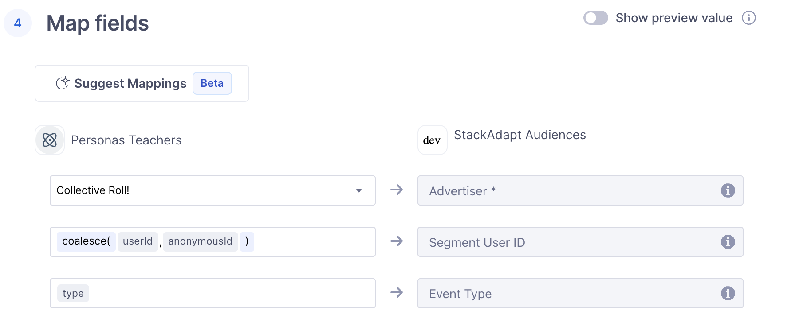



[StackAdapt](https://www.stackadapt.com/){:target="\_blank"} is a programmatic advertising platform specializing in audience engagement. StackAdapt enables marketers to deliver high-performing advertising campaigns across channels through real-time bidding, detailed audience targeting, and data-driven insights. StackAdapt’s integration with Segment Engage helps you sync user data to optimize targeting and improve your campaign outcomes.

This destination is maintained by StackAdapt. For any issues with the destination, please [submit a ticket to StackAdapt's support team](https://support.stackadapt.com/hc/en-us/requests/new?ticket_form_id=360006572593){:target="\_blank"}.

## Getting started

### Getting your StackAdapt GraphQL Token

If you do not have an API key, reach out to the StackAdapt team for help.

### Setting up the StackAdapt Audience destination in Segment Engage

1. From the Segment web app, navigate to **Connections > Catalog > Destinations**.
2. Search for and select the "StackAdapt Audience" destination.
3. Click **Add Destination**.
4. Select an existing source to connect to the StackAdapt Audience destination.
5. Give the destination a name.
6. On the Settings screen, provide your StackAdapt Graphql API token.
7. Toggle on the destination using the **Enable Destination** toggle.
8. Click **Save Change**.
9. Follow the steps in the Destinations Actions documentation to [customize mappings](/docs/connections/destinations/actions/#customize-mappings) or follow the steps below to Sync an Engage Audience.
10. Enable the destination and click **Save Changes**.

### Sync an Engage Audience

To sync an Engage audience with StackAdapt:

1. Each Engage audience should only contain profiles that meet StackAdapt’s targeting criteria. Each profile in the Engage audience must have a valid email address to be considered as a valid profile in the StackAdapt platform. Profiles missing an email address will not be valid on StackAdapt platform.
2. Add a condition to the Engage audience to ensure the required email trait is included.
3. Open the previously created StackAdapt destination.
4. In the **Mappings** tab, click **New Mapping** and select **Forward Audience Event**.
5. Under **Define event trigger**, click **Add Condition** and add this condition: **Event Type** is **Track** or **Identify**. Click **Add Condition** and add this condition: **Event Name** is `Audience Entered` or `Audience Exited`
6. Under **Map fields**, select the advertiser you want to sync the audience under. You can look for the advertiser by its ID on StackAdapt platform.
   

On StackAdapt platform:

1. Under **Audience & Attribution** > **Customer Data** > **Profiles**, you should be able to see a list of profiles being synced to StackAdapt platform.
2. Under **Audience & Attribution** > **Customer Data** > **Segments**, on the top right corner, click **Create Segment**.
3. Set the rules

### Sending an Audience to StackAdapt

1. In Segment, go to Engage > Audiences and select the audience to sync with StackAdapt.
2. Click Add Destination and select **StackAdapt Audience**.
3. Toggle **Send Track** and **Send Identify** on.
4. Click Save.

## Data and privacy

Review [StackAdapt's Data Processing Agreement](https://www.stackadapt.com/data-processing-agreement){:target="\_blank"} to learn more about StackAdapt's privacy and data terms.
